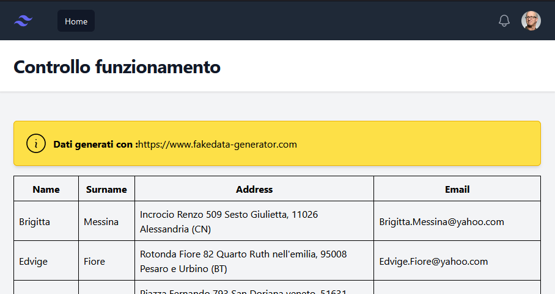

# PHP - Not working app
This project is a starting point to evaluate a Junior Developer on a PHP project.

## Requirement
* PHP 8.1 + extensions (PHP8.1-sqlite, etc)

## Steps
```bash
$ git clone https://github.com/nervaccio/not-working-php-app.git
$ cd not-working-php-app
$ composer install
$ composer populate-db
# Run local webserver
$ php -S localhost:8001 -t broken_app_test/
# Open the browser at http://localhost:8001
# You should see a list of users
```
You shoud see this as result.  



Every broken app can be accessed by the following command. Change the target folder accordingly.
```bash
$ php -S localhost:8001 -t broken_app_1/
```

php -S localhost:8001 -t broken_app_test/

## Todos
- [x] Skeleton
- [x] Basic documentation to install the application
- [x] Broken app - BUG 1
- [ ] Broken app - BUG 2
- [ ] Broken app - BUG 3
- [ ] Broken app - BUG 4

## Speciale Thanks ❤
* https://symfony.com
* https://www.fakedata-generator.com
* https://tailwindui.com/
* https://alpinejs.dev
* https://www.doctrine-project.org/

## License
MIT
